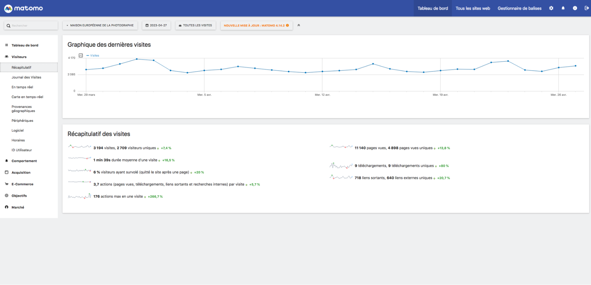

## Différences Matomo et Google Analytics

**Matomo et Google Analytics sont tous les deux des outils populaires et rempliront dans la grande majorité des cas tous les besoins de data-analytics dont vous aurez/avez besoin pour votre site.**

Dans les deux cas, ils vous permettront d’avoir accès à un panel d’informations détaillées ainsi qu’à des résumés vous permettant d’évaluer le trafic que génère votre site ainsi que les détails qui y sont associés, les comportements adoptés par les utilisateurs, etc…

Enfin, dans tous les cas, les deux peuvent être utilisés simultanément si vous en avez le besoin ou que vous souhaitez comparer les résultats des deux services.

La principale différence est que Matomo est Open source, c’est-à-dire que le code peut être télécharger et modifier pour les besoins du projet. Contrairement à Google Analytics, dont le code est précieusement gardé…

### Fonctionnalités uniques de Matomo

* **Contrôle total des données** récoltées auprès des visiteurs et utilisateurs
* **Personnalisable** : vis-à-vis de l’interface ainsi que des différents services nécessaires (puisque gratuit pour sa version serveur, différente de son service cloud)
* **Analyses vidéo du comportements des visiteurs** via la fonctionnalité payante Heatmap _(voir section addons payants)_
* **N’utilise pas obligatoirement de cookies** si précisé lors de sa configuration, donc pas d’écran de consentement aux cookies obligatoire _(cependant, dans notre cas il en faut un)_
* **Suivi automatique des formulaires** du site

### Respect du RGPD

**Mis à part dans sa future version 4 et contrairement à Matomo, Google Analytics ne respecte pas le RGPD (Règlement Général sur la Protection des Données), confrontant ainsi ses utilisateurs européens au risque de recevoir une amende de la part du CNIL.**

Sur ce sujet, Matomo bat en tous points Google Analytics, et ce pour plusieurs raisons :

* Pour sa version serveur, les données y restent stockées sur place et ne sont donc pas transmises à un acteur tiers. De ce fait, s’il est configuré correctement, il est possible de le rendre totalement RGPD-friendly.
* Matomo dispose nativement d’outils d'anonymisation des données personnelles, comme l’adresse IP entre autres, annihilant donc le côté “personnel” de ces informations dont le respect est nécessaire pour être conforme au RGPD.
* Enfin, puisqu’il est Open source, Matomo fera toujours en sorte d’être et de rester RGPD-friendly, et ce via des mises-à-jour gratuites.

## Fonctionnalités principales

### Précisions 

**Sur certains onglets, comme l’onglet _Pages_ de la section _Comportements_ par exemple, des informations supplémentaires sont disponibles via des icônes affichées au survol de la souris, vous permettant d’étudier en détail et/ou graphiquement certains aspects des informations concernées.**

Il est possible de sauvegarder ces informations dans leur état actuel sous différents formats, de les comparer / de les croiser en direct avec d'autres informations disponibles sur _Matomo_, de modifier la période qui nous intéresse, etc…

Il ne faut donc pas hésiter à survoler les différentes informations et icônes disponibles afin d’en obtenir une petite description et autres infos simplifiant leur compréhension.

### Dashboard / Tableau de bord

**Le Dashboard fait office de _hub_ d’accueil et offre une vue d’ensemble sur les statistiques. Il est personnalisable sur la base des différents modules proposés par Matomo. Il peut être réorganisé à votre guise (en drag & drop).**

Les modules affichables sur cette section reprennent tous les différents aspects de data-analytics de Matomo, comme les informations de connexion au site des utilisateurs, les produits e-commerces vendus ainsi que leurs détails associés ou encore les métriques KPI. 

En fonction des objectifs de l’entreprise, il peut donc être utile d’y placer les modules qui vous intéressent afin de ne pas perdre de temps à aller les chercher plus en détail autre part.

**Comment modifier son _dashboad_ ?**

* Cliquer sur “Tableau de bord”
* Choisir le widget qui m’intéresse et le placer où je le souhaite

**Ce que je peux y trouver / faire ?**

* Organiser les données qui m’intéressent afin d’avoir une synthèse rapide des statistiques
* Créer plusieurs tableaux de bords thématiques pour un accès rapide à mes données

### Visiteurs

**Dans l’onglet visiteurs, vous retrouverez toutes les informations de connexion des utilisateurs visitant votre site.**

Comme sur tous les onglets, une vue d’ensemble est disponible mais les différents sous-onglets vous permettront d’accéder à plus de détails. 

Parmi ces informations, vous retrouverez par exemple les horaires de connexion, les appareils utilisés pour accéder au site ainsi que leur OS, ou encore la localisation des visiteurs.

**Ce que je peux y trouver / faire ?**

* Consulter un récapitulatif de toutes les informations de connexions des visiteurs
* Voir les connexions en temps réel :
    * Au format carte géographique
    * Au format détaillé
* Analyser et comparer les différents systèmes utilisés par les utilisateurs pour naviguer sur le site web (IOS, Android, Windows, navigateur utilisé, etc…)
* Consulter les horaires ainsi que la localisation des connexions au site
* Accéder aux actions effectuées par l’utilisateur sur le site de la page d’entrée à la page de sortie

### Comportement 

**Différent de l’onglet visiteur, celui sur les comportements traite de comment les visiteurs interagissent avec le site internet.**

Par exemple, sur quels liens ont-ils cliqué, quelles pages sont les plus visitées ou encore les mots-clefs utilisés dans le moteur de recherche du site internet. 

**Précisions** : Si certains comportements ne sont pas pris en compte par défaut par Matomo, il est possible de **les mesurer dans le sous-onglet « événements »**. Vous pouvez les ajouter via Matomo directement à travers **la page « Gestionnaire de balises »** _(tags en anglais)_, accessible via le menu en haut à droite de l’écran, mais les **possibilités** de cette méthode sont **limitées**.

Il existe une seconde méthode, plus technique, mais leur ajout doit être **fait manuellement et requiert des compétences en développement web** , notamment à cause de l’ajout de javascript dans le code. Il est donc recommandé de faire appel à nous si vous souhaitez ajouter de nouveaux comportements impossibles à mesurer via le gestionnaire de balises. 

Ceci étant dit, si vous ajoutez de nouveaux évènements vous-même, pensez à **les nommer correctement** et à les **associer à la bonne catégorie** afin de permettre la bonne compréhension des informations par les autres membres de votre équipe.

**Ce que je peux y trouver / faire ?**

* Comparer les pages les plus et les moins visitées du site
* Consulter le flux de visiteurs : leurs pages d’entrées _(page à partir desquelles sont arrivés les visiteurs)_, pages de sorties _(pages qui ont fait quitter le visiteur du site)_, temps de session, etc…
* Voir les infos recherchées dans le moteur de recherche & les données métriques sur les fichiers téléchargeables du site
* Détailler les intéractions et habitudes des utilisateurs avec le site
* Consulter le rapport de performance des utilisateurs (temps de chargements, UX…)

### Acquisition 

**L’onglet acquisition traite des informations concernant le parcours effectué par l’utilisateur avant d’arriver sur votre site.**

Encore une fois, il dispose d’une vue d’ensemble ainsi que de sous onglets plus précis. Il vous permettra de savoir si les visiteurs sont arrivés via un moteur de recherche, en tapant directement le lien du site dans la barre d’URL ou encore s’ils viennent d’une campagne marketing, des réseaux sociaux, etc…

**Ce que je peux y trouver / faire ?**

* Consulter et analyser les canaux d’acquisition des visiteurs (campagnes marketing, site web externe, réseaux sociaux, etc…)
    * Ex : je souhaite avoir le détail de la provenance de tous les visiteurs du site. Je vais dans l’onglet “acquisition” puis dans le sous-onglet “tous les canaux” et tous les détails y sont affichés : qui vient de moteurs de recherche, de RS, …

* Voir les données en rapport avec les pages du site
    * Ex : dans le sous-onglet “pages”, vous pourrez étudier les pages les plus visitées, Matomo triant par défaut ces pages selon leur nombre de visites par jour. Vous pouvez évidemment changer la période afin de traiter les infos sur un plus large panel (voir section “[segments](#segments-11)” plus bas dans le document).

        

Par ailleurs, vous trouverez juste en dessous (toujours dans le sous onglet “pages” mais dans la section “référents”) le détail de la provenance de chaque canal : ici par exemple, juste après la recherche par mots-clefs via des moteurs de recherche, le canal qui rapporte de plus de visiteur à l’heure actuelle est une campagne marketing avec pour sujet “expositions”.

        

* Voir les mots-clefs tapés dans les moteurs de recherches (Google, Bing, etc…) utilisés pour trouver votre site à partir desdits moteurs
    * _Attention : certains mots-clefs peuvent apparaître comme indéfinis et nécessitent l’achat d’un module matomo supplémentaire (voir section “Addons payants” plus bas)_

### E-commerce / Objectifs 

**Ces deux onglets sont regroupés ensemble car dépendent intrinsèquement de ce pour quoi ils ont été configurés. Dans notre cas, l’onglet e-commerce traitera les informations relatives aux produits mis en vente sur la e-librairie, tandis que l’onglet objectif traitera des informations relatives à la page billetterie.**

Vous y retrouverez entre autres les produits consultés et/ou ajoutés au panier, le nombre de commandes validées / annulées ou bien encore le nombre de visiteurs ayant réservé des billets.

C’est sur ces onglets que vous trouverez les informations relatives au ROI (_Return On Investment_) les plus utiles. Enfin, puisque ces onglets sont configurables, si vous avez besoin de changer les informations qu’elles traitent, il est possible de le faire directement dans le sous-onglet « gérer les objectifs ». Il faut savoir qu’il est possible d’enregistrer plusieurs objectifs personnalisés.

**Ce que je peux y trouver / faire ?**

* Attribution et suivi d'objectifs personnels dépendant du site et du comportement de ses visiteurs sur certaines pages “clefs”.
    * Dans le cas de la MEP, vous trouverez dès votre arrivée sur l’onglet “Objectifs” et plus en détails dans le sous-onglet “accès billetterie” des informations sur le nombre de visites de la page billetterie (nb de visites appelées “conversions” sur Matomo) ainsi que d’autres données reliées.

* Voir le détail des intéractions avec la boutique et les produits vendus sur le site.
    * _Attention : dans le cas d’une boutique WooCommerce, certaines informations peuvent être inconnues par Matomo et nécessitent l’achat d’un module supplémentaire (voir section “Addons payants” plus bas)_

### Segments 

**Par défaut, Matomo affiche les informations qu’il mesure en fonction de tout type de visites confondus, mais il est possible de filtrer lesdites informations via les segments.**

Il s‘agit d’une fonctionnalité de filtres vous permettant d’affiner les informations traitées et affichées par Matomo.

**Ce que je peux y trouver / faire ?**

* Afficher les informations relatives aux visites en France uniquement. 
* Afficher les visites pour les utilisateurs restant sur le site plus de 2mn
* Afficher les visites dont le nombre d’interactions est inférieur à 5
* etc.

**Comment créer un segment ?**

* Sur n’importe quelle page Matomo (Visiteurs,  Comportements, etc.), cliquer sur “Toutes les visites” (le segment par défaut correspond à toutes les visites…)
* Cliquer sur “Ajouter un nouveau segment”
* Définir un Nom au segment pour mieux l’identifier plus tard
* Définir la condition de ce nouveau segment : 
    * sujet de la condition (_Acquisition_ > _Nom du référent_, par exemple)
    * valeur de la condition (“_Google_”, par exemple)
* Les segments seront enregistrés et disponibles sur toutes les vues

### Envoi de rapports automatiques

**Matomo propose l’envoi de rapports personnalisés et automatiques pour vous tenir informé des informations que vous considérez les plus importantes et ce, de façon régulière.**

Vous choisissez vous même les données à intégrer ainsi que la fréquence d’envoi à laquelle vous souhaitez recevoir les rapports (quotidienne, hebdomadaire ou mensuelle). Ils peuvent être envoyés par mail sous différents formats ou par SMS _(pour un coût supplémentaire et avec plus de configuration requise que pour l’envoi par mail)_.

De plus, Matomo vous fournit sur la droite de la page toutes les indications pour vous aider à bien comprendre et configurer tous les champs de votre rapport.

**Ce que je peux y trouver / faire ?**

* Choisir les données à envoyer en fonction du panel proposé (tout en bas) ainsi que la période traitée pour les données traitées
* Définir les formats d’affichage des données (graphiques ou tableaux, les deux, etc…)
* Définir la fréquence et l'heure d’envoi ainsi que son support et format d’envoi (mail format HTML, PDF, CSV, etc… OU SMS)
* Créer des rapports sans fréquence d’envoi, stockés et actualisés automatiquement dans Matomo sans les envoyer par mail (similaire à une vue filtrée personnalisée)

**Comment créer un rapport ?**

* Rendez vous dans la page “administration” de Matomo (logo d’engrenage dans le menu bleu, en haut à droite de votre navigateur) > onglet “personnel” > sous-onglet “rapports e-mail”
* Remplissez les différents champs du formulaire
* Sélectionnez les différentes données à envoyer ainsi que leurs spécifications
* Tout en bas de la page, cliquez sur le bouton “créer le rapport”

## Addons - Extensions

**Matomo propose des fonctionnalités étendues via l’achat d’extensions.**

La liste complète des extensions se trouve ici : [https://plugins.matomo.org/](https://plugins.matomo.org/)

Certaines de ces extensions sont gratuites. Celles-ci sont davantages des améliorations techniques du Core logiciel de Matomo. Les extensions payantes sont davantage “grand-public”.

Les extensions payantes les plus notables sont : 

### Heat Map

* **Prix**
    * Entre **229$ / an** pour **4 utilisateurs max.** & **689$ / an** pour un **nombre d’utilisateurs illimité**
* **Fonctionnalités**
    * Suivi de toutes les intéractions utilisateurs (clics, défilement, frappe & survol) à travers des videos de replay
* **Pertinence**
    * Plus de précisions vis-à-vis des intéractions utilisateurs. Très utiles pour mieux comprendre les besoins et l’UX des visiteurs afin de mieux les convertir / de corriger certains défauts sur votre site.
* [https://plugins.matomo.org/HeatmapSessionRecording](https://plugins.matomo.org/HeatmapSessionRecording)

### User Flow

* **Prix**
    * Entre **99$ / an** pour **4 utilisateurs max.** & **299$ / an** pour un **nombre d’utilisateurs illimité**
* **Fonctionnalités**
    * Représentation visuelle des chemins de pages naviguées par l’utilisateur
* **Pertinence**
    * Permet de mieux comprendre les besoin des visiteurs de notre site en analysant les chemins les plus fréquents
    * _Exemple : Si la grande majorité des utilisateurs passe de la page d’accueil à la page “renseignements” puis à la page “téléchargements”, User Flow vous permettra de le visualiser et de le comprendre graphiquement afin d’apporter des modifications au site si nécessaire._
* [https://plugins.matomo.org/UsersFlow](https://plugins.matomo.org/UsersFlow)

### WooCommerce Analytics

* **Prix**
    * **39$ / an** pour un **nombre d’utilisateurs illimité**
* **Fonctionnalités**
    * Fonctionnalités et métriques supplémentaires avec l’intégration d’une boutique WooCommerce.
* **Pertinence**
    * Si votre boutique fonctionne sous WooCommerce, ses données ne seront pas récoltées nativement par Matomo, nécessitant donc l’achat et l’intégration de ce module supplémentaire (si vous en avez l’utilité).
    * **_IMPORTANT : un support de la boutique est déjà installé & configurable si le plugin [Matomo for WP](https://wordpress.org/plugins/matomo/) est présent sur votre site Wordpress, limitant l'intérêt de ce module. Pensez donc à bien vérifier dans votre tableau de bord WP._**
* [https://plugins.matomo.org/WooCommerceAnalytics](https://plugins.matomo.org/WooCommerceAnalytics)

### Search Engine Keywords Performance

* **Prix**
    * Entre **159$ / an** pour **4 utilisateurs max.** & **489$ / an** pour un **nombre d’utilisateurs illimité**
* **Fonctionnalités**
    * Permet de récupérer tous les mots clefs tapés dans les moteurs de recherche avant d’accéder à votre site dans l’onglet “acquisition” en **supprimant la contrainte des mots-clefs indéfinis** (présent sur la version gratuite de cette fonctionnalité).
* **Pertinence** 
    * Permet de mieux analyser l’acquisition d’utilisateurs sans faire face à des données inconnues.
* [https://plugins.matomo.org/SearchEngineKeywordsPerformance](https://plugins.matomo.org/SearchEngineKeywordsPerformance)

### A/B Testing

* **Prix**
    * Entre **229$ / an **pour** 4 utilisateurs max.** & **689$ / an **pour un **nombre d’utilisateurs illimité**
* **Fonctionnalités**
    * Permet de comparer en live 2 versions du site, ou plutôt 2 versions d’une même page. En observant les actions de l’utilisateur, nous pouvons déterminer quelle mise en page ou quel contenu serait plus efficace auprès de l’audience du site.
* **Pertinence** 
    * Permet d’affiner ou d’arbitrer des choix ergonomiques au moment d’une refonte du site internet.
* [https://plugins.matomo.org/AbTesting](https://plugins.matomo.org/AbTesting) 

## Sources & Ressources

**Tutoriels vidéo officiels (EN)**

* [https://fr.matomo.org/web-analytics-training](https://fr.matomo.org/web-analytics-training)

**Formation Ronan Hello (FR)** : 

* [https://ronan-hello.fr/series/matomo](https://ronan-hello.fr/series/matomo)

**Google Analytics vs. Matomo & RGPD :**

* [https://matomo.org/blog/2017/09/gdpr-potential-consequences-matomo](https://matomo.org/blog/2017/09/gdpr-potential-consequences-matomo)
* [https://kinsta.com/fr/blog/matomo-vs-google-analytics/](https://kinsta.com/fr/blog/matomo-vs-google-analytics/)
* [https://www.codeur.com/blog/matomo-vs-google-analytics/](https://www.codeur.com/blog/matomo-vs-google-analytics/)